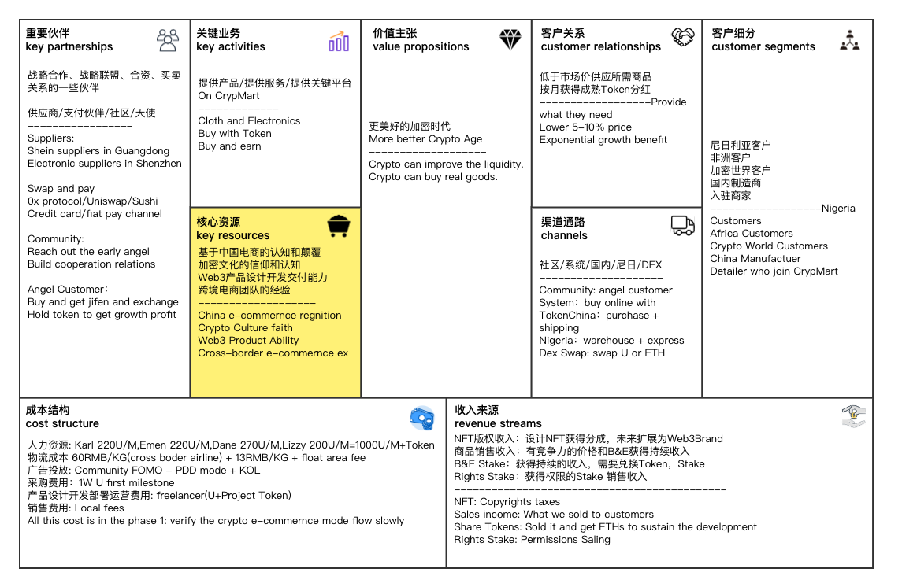

# CrypMart introduction

## Who we are?
+ We are a small team in Web3, want to build a Community Production.
+ Which will help the manufactures to get liquidity.
+ And help the buyers to get stable rate、low price and rich varieties goods.
## What CrypMart want to provides?
+ A product owned by Community.
+ A Decentralized Crypto Market, you can sell and buy in crypto tokens.
## How we make it happen?
+ We have worked on CrypMart for almost one year from 2021 October.
+ See the Business Chart:

## Q&A
### Do you fear someone copy your model?
+ Yes, but Open will get more supporters and sustainable developing.
+ So we denied the commerce area usings and open source on the core contracts.

### Is the CrypMart legal?
+ Yes, we purchase goods from China and all over the world with fiat.
+ And we accept any crypto tokens fulfill the base liquidity requirements.
+ Exchange the tokens and get fiat by our legal partners.

### How can I begin to use?
+ Access the [https://CrypMart.xyz](https://CrypMart.xyz).
+ Select one group buy commodity and click buy button.
+ Pay the tokens and set your shipping address then waiting the delivery.

### How about the post-sale service?
+ Phase one, we have no post-sale service.
+ We are looking for partners to hold this service in different areas in Africa first.

### How about the exponential growth?
+ CrypMart will spread by the Social Network and growth like complex systems.
+ The most amazing is here: you can trust CrypMart zero, but you can trust the contract!
+ Get the benefits of CrypMart produced with onchain smart contract's guarantee.